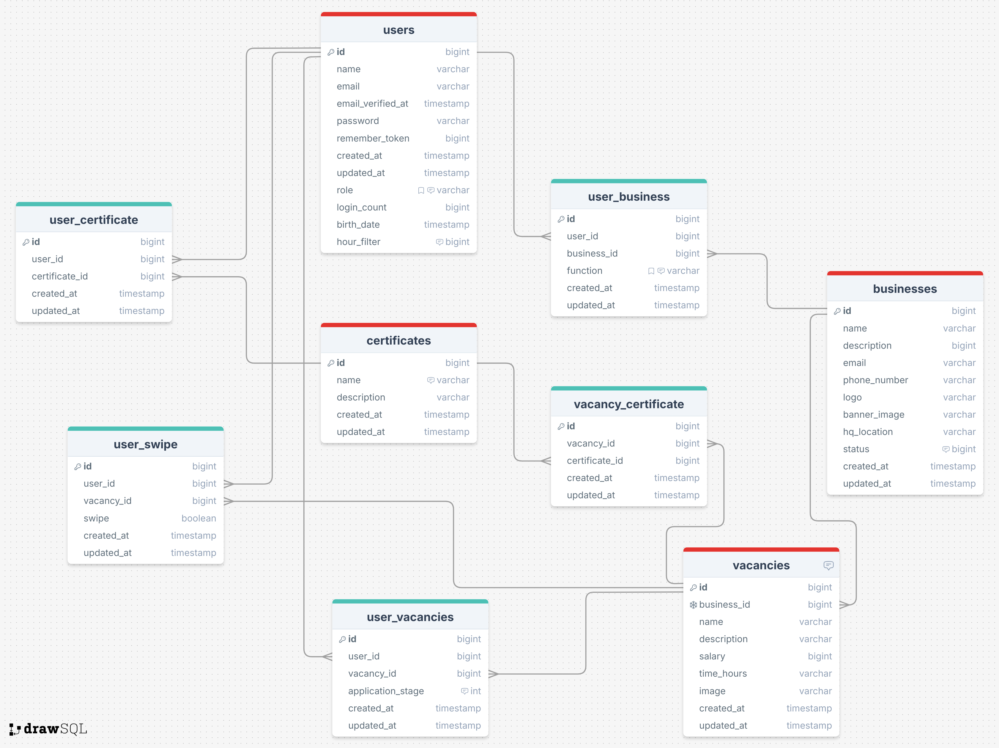
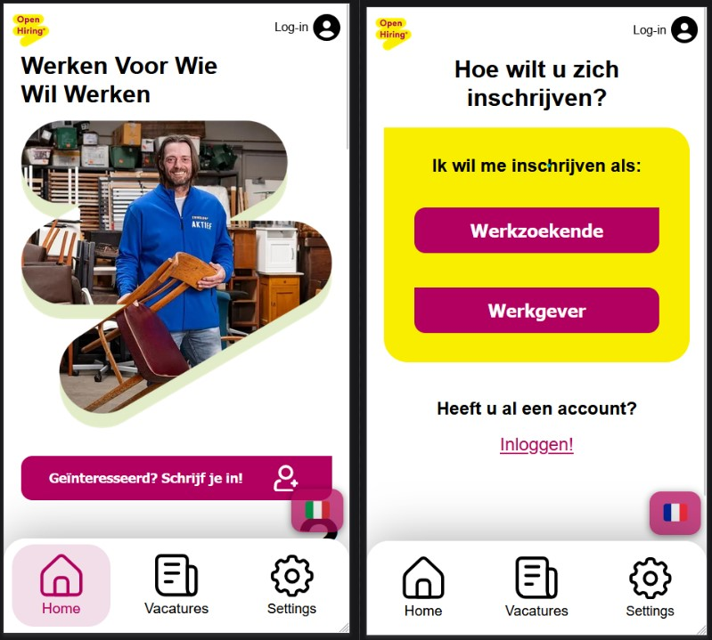
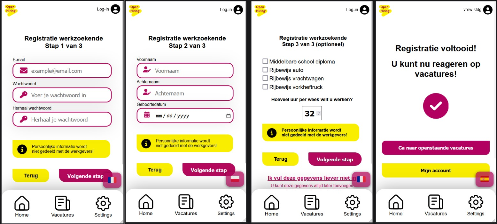
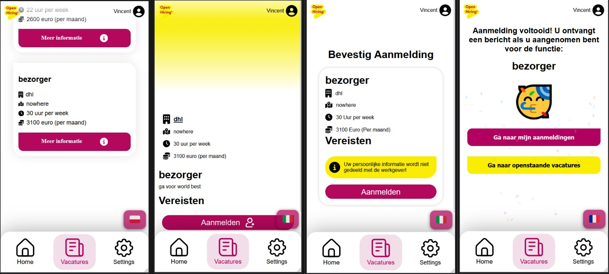
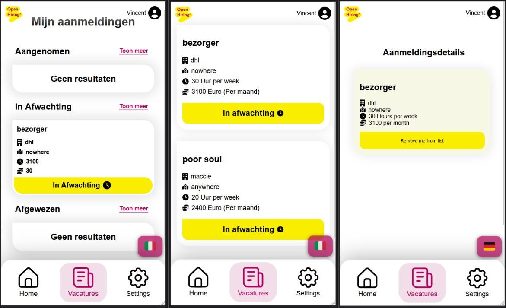
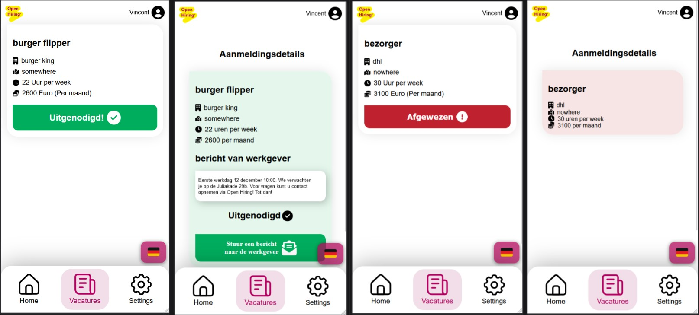
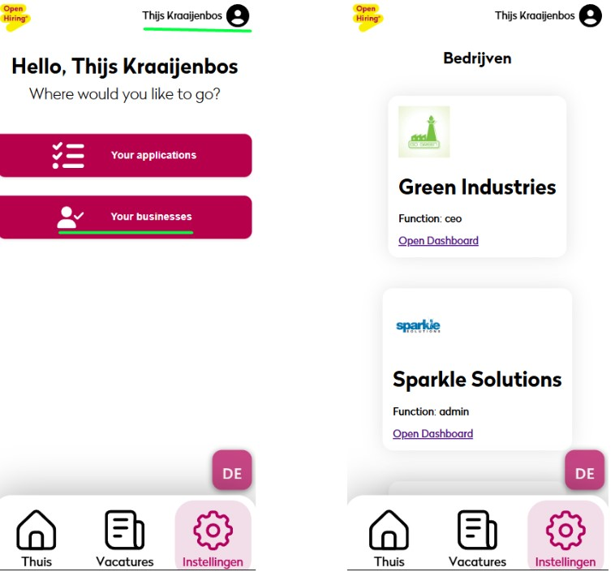
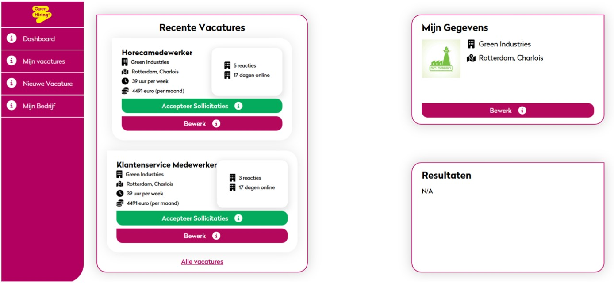
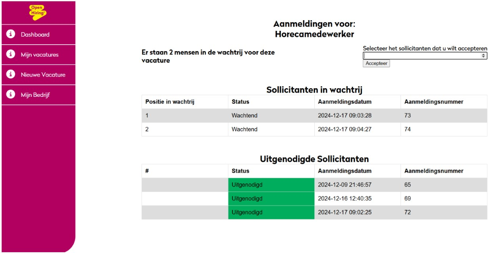
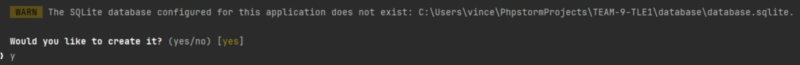

# Overdrachtsdocument

## voor doorontwikkeling:

de huidige readme is van laravel zelf deze hebben we laten staan omdat er veel relevante informatie in staat.

Bij de namen conventie zijn een aantal dingen in de soep gelopen. De login steps zijn eigenlijk de registratie steps. Ook wordt er op sommige plekken gesproken over “aangenomen”. Dit betekent “uitgenodigd”. Alle models uit het ERD (hierboven) zijn al aangemaakt en klaar voor gebruik.

## Handleiding werkzoekende:

Op de homepagina krijg je al een paar dingen te zien. De call to action on te registreren, de login rechtsboven & de navbar. We gaan starten met een account aanmaken zodat we inschrijvingen kunnen zien. Als je hierop klikt krijg je een vraag te zien of je een werkzoekende of werkgever bent. Hier kies je werkzoekende. 

Nu kom de in de registratie terecht voor werkzoekende. Hier krijg je een disclaimer dat je informatie niet wordt gedeeld met de werkgevers. Op de eerste stap geef je een email en wachtwoord. De tweede stap vraagt om leeftijd en naam dit kan je mogelijk later gebruiken bij klantenservice als je problemen hebt met je account. De laatste stap is om aan te geven hoeveel je wilt werken en wat je kan. Deze informatie kant je later nog toevoegen bij je instellingen. Als je nu op vacatures klikt kan je jezelf aanmelden op vacatures. 

Hier krijg je alle openstaande vacatures zien. Als je bij een vacatures klikt op” meer informatie” krijg je de gehele vacature te zien met een aanmeldknop. Daarna krijg je nog een vraag voor bevestiging. Als je dan weer klikt op “aanmelden” krijg je het scherm te zien. Hier kan je kiezen om naar je dashboard te gaan.

Op je dashboard zie je de meest recente aanmelding in elke categorie. Als je op toon meer klikt word je doorverwezen naar de volgende pagina. Hier zie je status pagina met alle aanmeldingen in die status. Als je kijkt op de status “in afwachting” dan zie je alle aanmeldingen waar de werkgevers nog op moeten reageren. Als je op een aanmelding klikt kom je op de “aanmeldingsdetails” waar je nog kan uitschrijven.  Dit zijn de functionaliteiten voor de werkzoekende. 

Als je vanuit het dashboard op toon meer klikt bij de “aangenomen” aanmeldingen klikt krijg je alle aanmeldingen te zien waarvoor je bent aangenomen. Dit is ook het geval bij de afgewezen afmeldingen.

Bij de aangenomen aanmelding krijg je een bericht te zien van de werkgever. De knop om een bericht te sturen werkt niet. Hier kan in de volgende iteratie aan door ontwikkeld worden.

## Handleiding werkgever:

Op dit moment is er nog geen manier om een bedrijfsaccount aan te vragen, alhoewel er wel al een knop voor is bij de registratiepagina. De focus ligt vooral op het werkgeversdashboard, die je zou kunnen zien als een specifieke gebruiker in de database gelinked is aan een bedrijf met een functie die “CEO” of “admin” is. Dit is specifiek voor de eigenaar van het bedrijf wanneer hij/zij een bedrijfsprofiel heeft gekregen van de OpenHiring admins, of voor managers van een bedrijf die de CEO heeft toegevoegd als collega’s aan het bedrijfsprofiel. Op dit moment is er ook nog geen manier om collega’s toe te voegen, dus dit gaat nu nog direct via de database.
Voor de showcase is er op de server een profiel aangemaakt met de volgende inloggegevens;
email: admin@admin.nl
wachtwoord: admin1234
Dit account is gelinkt aan alle 4 de bedrijven waarvoor dummydata is, je kunt toegang tot de dashboards van deze bedrijven krijgen door in te loggen op dit account en daarna rechtsboven te klikken.

Je komt dan op de volgende pagina waarbij je op ”your businesses” kunt klikken. Deze knop stuurt je door naar de lijst met alle bedrijven waar je de ”ceo” of ”admin” functie hebt in de database. Je kunt dan op “open dashboard” klikken waarna je wordt doorgestuurd naar het bedrijfsdashboard (belangrijk: dit dashboard is georiënteerd voor Desktop apparaten in plaats van mobile telefoons)

Op het dashboard kun je gemakkelijk alle informatie van jouw eigen vacatures en jouw bedrijf zien, aanmaken en bewerken. Ook kun je een specifiek aantal sollicitanten per vacature uitnodigen door op “accepteer sollicitaties” te klikken. Daarna vul je een nummer in voor het aantal sollicitanten naar wie je een uitnodiging wilt sturen. Nadat een sollicitant is uitgenodigd kan hij of zij op de “Mijn Aanmeldingen” pagina zien dat hun aanmelding voor jouw vacature is geaccepteerd en dat ze dus een uitnodiging hebben ontvangen.

## Opzetten project op nieuwe machine

Om aan het project te kunnen werken moet je een paar dingen doen. NPM-installatie, composer installatie en een key voor de github.

Open het project in je IDE. Hier open je een terminal (op PhpStorm alt+f12) voor de commando’s die je moet uitvoeren.

Laten we starten met node packages. Open de terminal window en voer de commando “npm i” uit. Nu worden alle nodige node packages geinstalleerd.  Als dit is gelukt kunnen we door naar de volgende commando.

Nu gaan we composer installeren met het volgende commando: “composer install”. Nu is alles geïnstalleerd en kunnen we een key genereren om het project lokaal te draaien.

Voor de volgende stap checkout develop (zeer belangrijk voor .env.example file). Gebruik “cp .env.example .env” om een backup te maken van je env file. Nu maak je de key aan met “php artisan key:generate” .  Deze is nodig om het project te runnnen. Dus nu heb je de volgende dingen gedaan: npm packages geïnstalleerd, composer geïnstalleerd & je key gegenereerd.

Nu is er nog 1 laatste stap om de database te laten werken. Hiervoor open je weer een terminal en voer je de volgende commando uit: “php artisan migrate”.  Je krijgt nu de volgende vraag omdat je nog geen database hebt. Hier zeg je “yes”.

Nu is je database lokaal aangemaakt.

Met “php artisan serve” & “npm run dev” start je jouw project op. Hiervoor heb je 2 terminals nodig 1 voor artisan serve en 1 voor run dev. Nu kan je aan de applicatie door ontwikkelen.

## Project op server zetten

Zorg dat alle features op de main branch staan in github

Open powershell

Voer ssh comand uit met: ssh (user)@(ip van de server)

Voer het wachtwoord van de user in

Als je connected ben doe je: ./deploy.sh

Dan krijg je prompt voor machine name

Daar moet de name zijn: open-hiring-team9

Klik op enter. Dan wordt de main branch van de GitHub repository naar de server gekopieerd.

Nu vraagt die weer om het wachtwoord voer hetzelfde wachtwoord in.

Nu staat het project op de server. 
